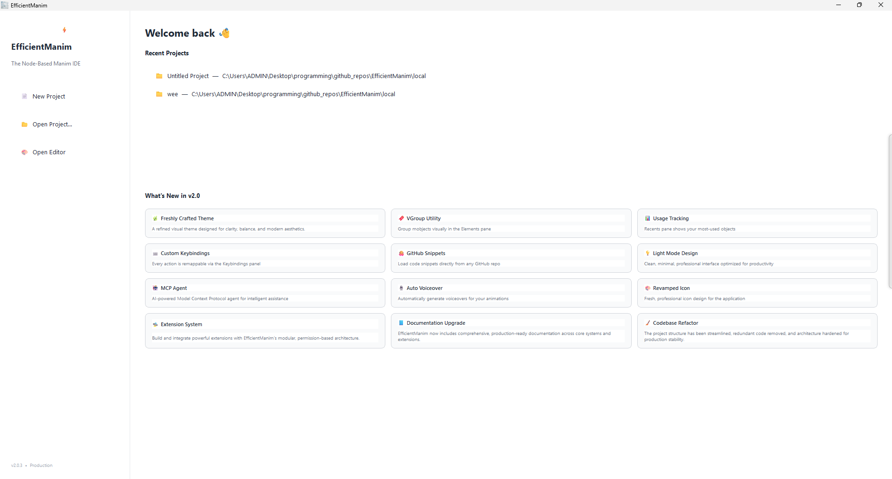
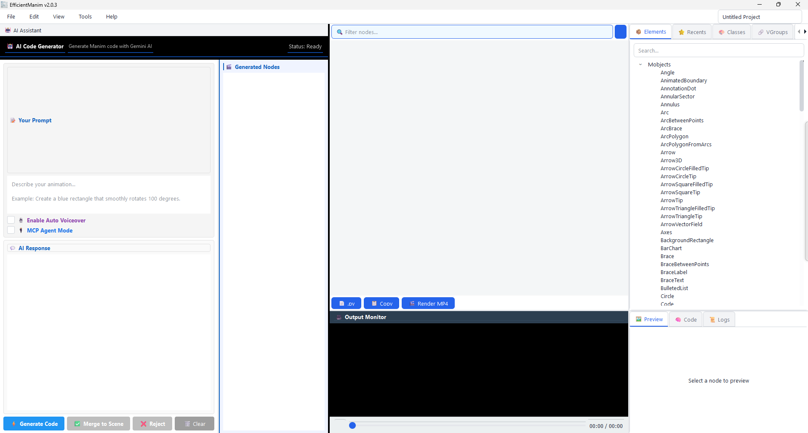
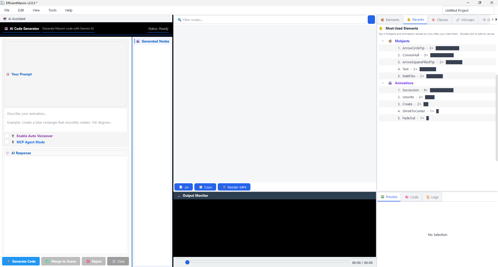
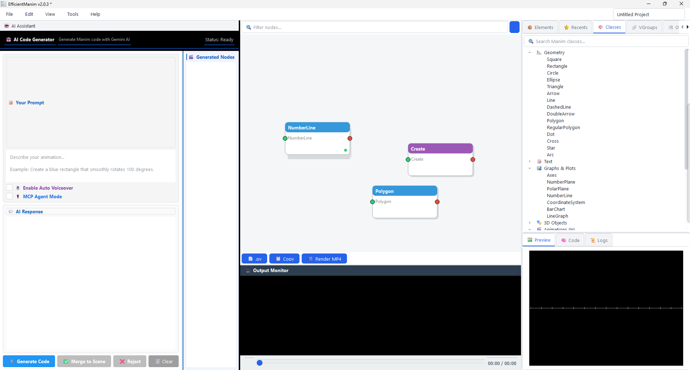

# EfficientManim

**The Ultimate Node-Based Manim IDE**  
*Create mathematical animations visually with the power of Python, AI, and Type Safety.*

---

## 🚀 Core Features

### 🎬 Node-Based Workflow
*   **Visual Editor:** Drag and drop Mobjects and Animations. Wire them together to create logic flows.
*   **Infinite Canvas:** Infinite panning and zooming canvas to manage large node graphs.
*   **Live Preview:** See static previews of individual nodes as you tweak parameters.

### 🎙️ AI Voiceover Studio (New)
*   **Gemini TTS Integration:** Generate realistic voiceovers using Google's Gemini 2.5 models.
*   **Auto-Sync:** Automatically synchronizes animation duration to the generated audio length.
*   **Multi-Voice:** Choose from varied voices (Zephyr, Puck, Fenrir, etc.).

### 📦 Portable Project Format (.efp)
*   **Bundled Assets:** Images, sounds, and videos are automatically copied and zipped into the project file.
*   **Cross-Platform:** Projects created on Windows work on Linux/Mac. The system automatically handles path conversions.

### 🛡️ Robust Type Safety System
*   **Smart Parsing:** Automatically distinguishes between numeric values, colors, vectors, and asset file paths.
*   **Crash Prevention:** Prevents "ufunc" errors by validating inputs before they reach the Manim renderer.
*   **ImageMobject Support:** Correctly handles UUIDs vs. Filenames to ensure images render correctly.

### 🤖 Gemini AI Integration
*   **Text-to-Animation:** Describe an animation in plain English, and the AI generates the node graph.
*   **Node Extraction:** The AI code is parsed into editable nodes (Mobjects and Animations).
*   **Merger Logic:** AI-generated nodes are fully integrated into the existing scene graph.

### 🎬 Professional Video Rendering
*   **Full Scene Export:** Render your complete node graph to MP4/WebM.
*   **Custom Settings:** Control Resolution (up to 4K), Framerate (15-60 FPS), and Render Quality.

---

## 🛠️ The Interface

### 1. The Graph Editor
The central canvas where you arrange your scene.
*   **Pan:** Hold **Middle Mouse Button** or **Shift+Drag** to move around.
*   **Zoom:** Use **Ctrl + Scroll** to zoom in and out.
*   **Select:** Left click and drag to rubber-band select nodes.

### 2. The Enhanced Inspector
A powerful 3-column property editor located on the right.
*   **Value Input:** Context-aware widgets (Color pickers, File selectors, Spinners).
*   **Enabled Checkbox:** Toggle parameters on/off.
*   **Escape Checkbox:** Removes quotes from string values (for variables).

### 3. Voiceover & Assets
*   **Voiceover Tab:** Generate TTS audio and attach it directly to specific animation nodes.
*   **Asset Manager:** Drag & Drop images/sounds. Assets are auto-linked by ID.

---

## ⚙️ Example Workflow

1.  **Import Assets:** Go to the Assets tab and import a `.png` file.
2.  **Add Nodes:** Add an `ImageMobject` and a `FadeIn` animation.
3.  **Voiceover:** 
    *   Go to the **Voiceover** tab.
    *   Type a script and click **Generate Audio**.
    *   Select the `FadeIn` node in the "Sync" dropdown.
    *   The animation will now last exactly as long as the spoken text.
4.  **Connect:** Wire the nodes together.
5.  **Render:** Go to the Video tab and export your video.

---

## ⌨️ Keyboard Shortcuts

### 📁 File Operations
| Action | Shortcut | Description |
| :--- | :--- | :--- |
| **New Project** | `Ctrl` + `N` | Clears the current project. |
| **Open Project** | `Ctrl` + `O` | Open an existing `.efp` project. |
| **Save Project** | `Ctrl` + `S` | Save the current project. |
| **Exit** | `Ctrl` + `Q` | Quit (Prompts to save if modified). |

### ✏️ Editing
| Action | Shortcut | Description |
| :--- | :--- | :--- |
| **Undo** | `Ctrl` + `Z` | Undo the last action. |
| **Redo** | `Ctrl` + `Y` | Redo the last undone action. |
| **Delete** | `Delete` | Delete the selected nodes/wires. |

### 👁️ View & Canvas
| Action | Shortcut | Description |
| :--- | :--- | :--- |
| **Zoom In** | `Ctrl` + `+` | Zoom into the canvas. |
| **Zoom Out** | `Ctrl` + `-` | Zoom out of the canvas. |
| **Mouse Zoom** | `Ctrl` + `Scroll` | Smooth zoom at mouse position. |
| **Pan** | `Middle Mouse` | Drag canvas to pan. |
| **Fit View** | `Ctrl` + `0` | Fit all nodes on screen. |
| **Clear All** | `Ctrl` + `Alt` + `Del` | Deletes **all** nodes and wires. |

---

## 🚀 Getting Started

### 🛠️ Prerequisites

Before running the app, ensure you have the following installed on your system:

1.  **Python 3.10+**: [Download Python](https://www.python.org/downloads/)
2.  **FFmpeg**: Required for video rendering and audio processing.
    *   [Download FFmpeg](https://ffmpeg.org/download.html)
    *   *Important:* Ensure `ffmpeg` is added to your system's PATH variable.
3.  **LaTeX** (Optional): Required only if you want to render LaTeX locally instead of using the online API.
    *   Windows: [MiKTeX](https://miktex.org/)
    *   Mac: [MacTeX](https://www.tug.org/mactex/)
    *   Linux: `texlive-full`

### 📦 Installation

1.  **Clone the repository:**
    ```bash
    git clone https://github.com/yourusername/EfficientManim.git
    cd EfficientManim
    ```

2.  **Install Python dependencies:**
    ```bash
    pip install -r requirements.txt
    ```

    *If you prefer installing manually:*
    ```bash
    pip install manim PySide6 google-genai pydub requests numpy
    ```

3.  **Run the Application:**
    ```bash
    python main.py
    ```
    
## 📸 Screenshots






---

Made with lots of ❤️💚💙 by Soumalya a.k.a. @pro-grammer-SD.

Discussions at this subreddit: https://www.reddit.com/r/manim/comments/1qck0ji/i_built_a_nodebased_manim_ide_with_ai_assistance/
