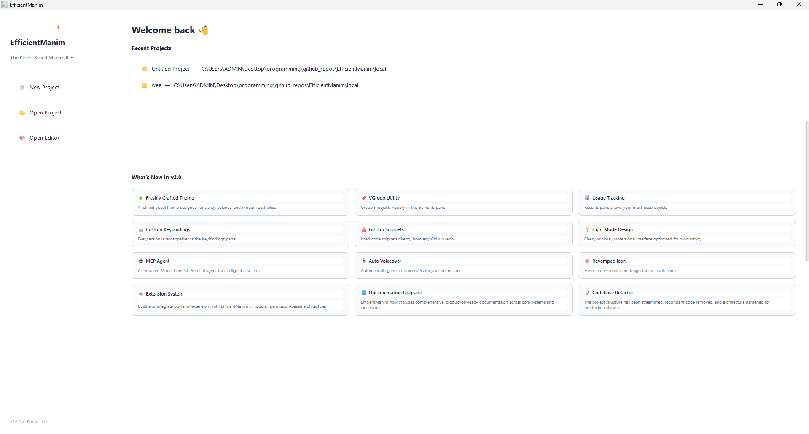
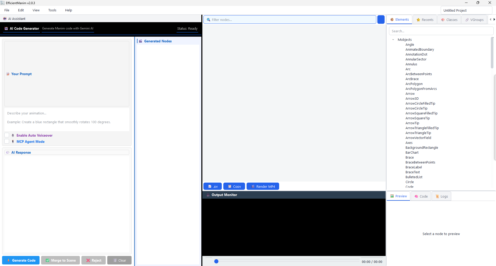
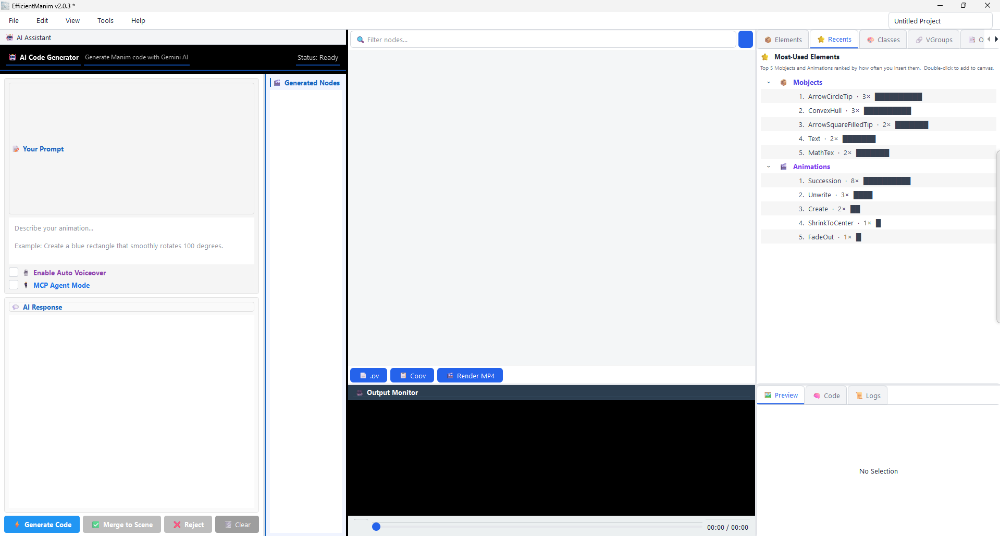
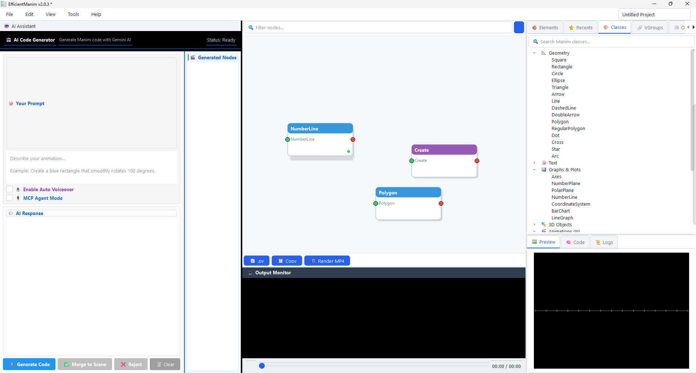
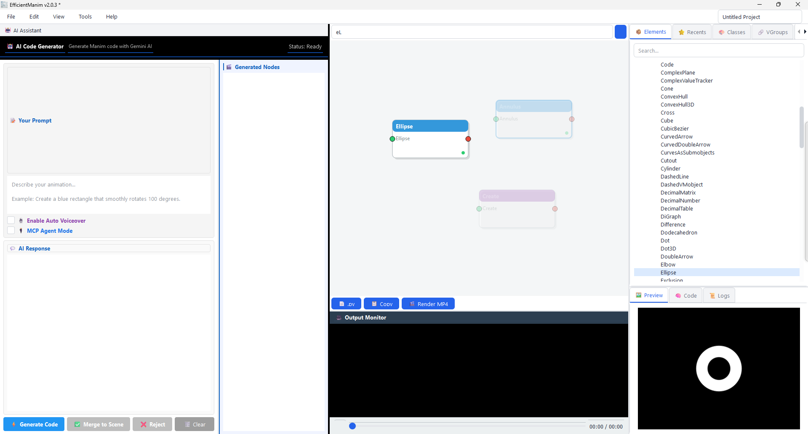
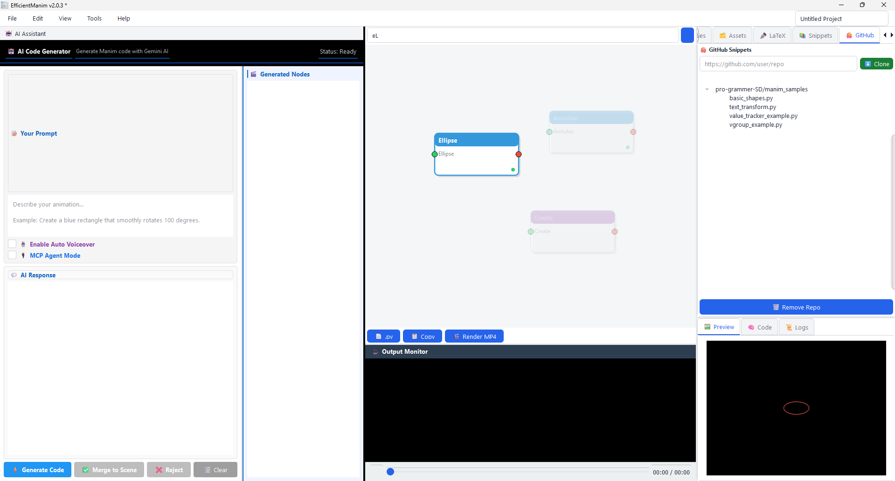
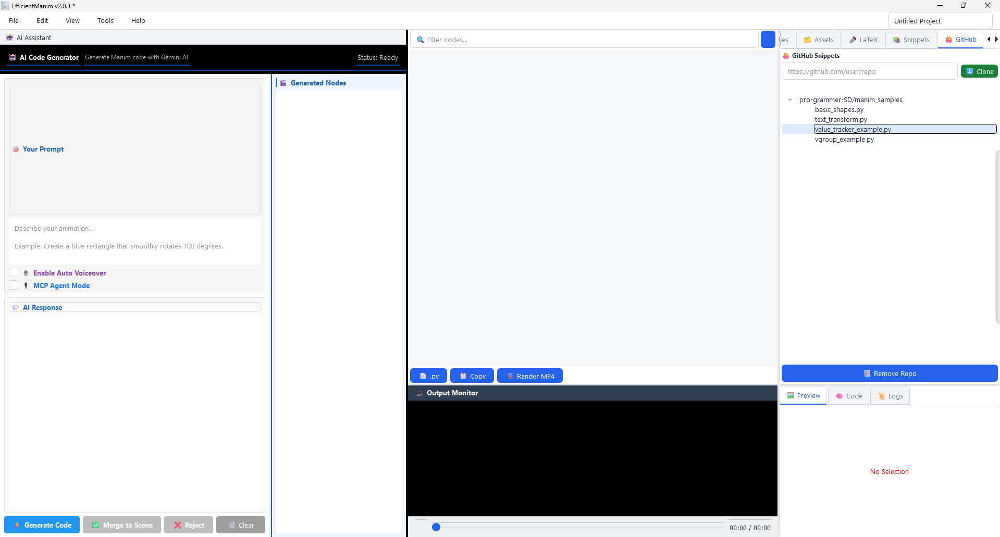
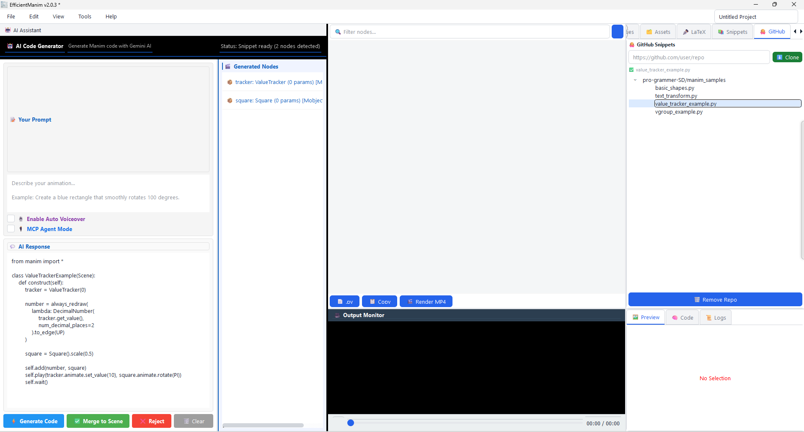
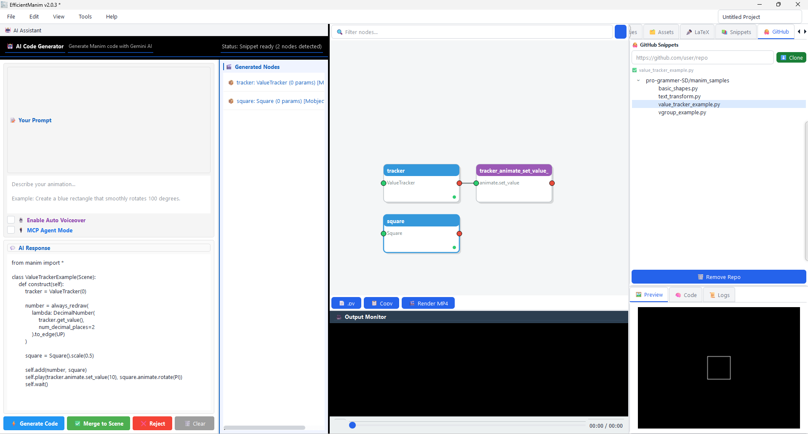

# 🌿 EfficientManim — The Ultimate Node-Based Manim IDE


**🌈 Create mathematical animations visually with the power of Python, AI, and Production-Grade Type Safety.**

---

## 🚀 Key Features

### 📄 Convert Slides into Animated Math Videos
- What it does: Upload one or multiple PDFs and the AI turns each slide into animated Manim scenes and a ready-to-edit node graph.
- Who it's for: Students, teachers, and YouTube educators who need clear animated explanations quickly.
- Why it's powerful: It converts static slides into structured animations automatically, saving hours of manual scene building.
- How it works: PDFs are parsed into slide structure, sent to the AI for an animation plan, then converted into Manim code and nodes.

### 🎬 Node-Based Visual Workflow
- **Visual Editor:** Drag-and-drop Mobjects and Animations with intuitive wiring
- **Infinite Canvas:** Pan and zoom freely to manage large node graphs
- **Live Preview:** Real-time static previews of individual nodes
- **Smart Connections:** Automatic wire validation and scene synchronization

### 🤖 AI Features
- **Prompt-to-Manim Code:** Describe animations in plain English and get runnable Manim code
- **PDF Slide Animation:** Attach PDFs in the AI tab and generate animated scenes automatically
- **AI Voiceover Studio:** TTS generation with multi-voice support and duration syncing

### 🎯 Tooltips

* Every button, panel, and action now includes a clear tooltip
* Instantly understand what anything does without searching the documentation
* Faster navigation, fewer mistakes, and a smoother workflow
* The interface becomes self-explanatory, even for first-time users

This makes the app easier to learn, faster to use, and far more intuitive overall.

### 🎬 Multiple Scenes
- Manage multiple scenes per project in the **Scenes** tab
- Create, rename, delete, and switch between scenes — each with its own node graph
- Scene state auto-saved and restored when switching

### 📦 VGroup Utility
- Select Mobject nodes → click **Create VGroup** in the **VGroups** tab
- VGroup code automatically generated: `group_1 = VGroup(circle_1, square_1)`
- Groups shown in expandable tree view

### 🐙 GitHub Snippet Loader
- Clone any GitHub repository into `~/.efficientmanim/snippets/`
- Browse `.py` files; double-click to load into AI panel as snippet
- All cloned repos automatically repopulated on startup

### ⭐ Recents Panel
- Top-5 most-used Mobjects + top-5 most-used Animations tracked per session
- Persisted to `~/.efficientmanim/usage.json`
- Double-click to instantly add to canvas

### ⌨️ Editable Keybindings
- **Help → Edit Keybindings…** opens the keybindings editor
- Double-click any shortcut to change it
- Duplicate detection; changes persisted to QSettings

### 📁 Editable Project Name
- Project name textbox in the top-right corner of the window
- Rename your `.efp` file without leaving the editor

### 📦 Portable Project Format (.efp)
- Bundled images, sounds, and videos included
- ZIP-based, cross-platform, easy to share

### 🌓 Dark / Light Themes
- Full dark mode with no white bleed-through
- Switch via the theme button in the corner or Settings
- QSS-based styling with ColorToken system

### 🎨 Manim Class Browser
- 60+ Manim classes in 8 categories (Geometry, Text, Graphs, 3D, Animations, etc.)
- Search bar filters in real-time
- Double-click or drag to add node to canvas

### 🎬 Professional Video Rendering
- Full scene export to MP4/WebM
- Up to 4K resolution, 15–60 FPS, quality presets


### 🧭 Advanced MCP + History Control
- All actions—including node edits, wires, VGroups, scenes, project I/O, rendering, assets, AI workflows, themes, keybindings, and TTS—are now available via `docs/mcp_commands.md` with consistent structured JSON responses.
- The rewritten `HistoryManager` captures grouped atomic operations (AI merges/imports, property edits, motion, wiring) and exposes per-node undo/redo stacks plus project/scene/node checkpoints (`docs/history_system.md`).
- Use the new `history.*` MCP commands (`undo_project`, `redo_node`, `restore_checkpoint`, `timeline`, `replay`, etc.) to inspect diffs, summaries, and timeline metadata before issuing state changes.

### 📚 Documentation Links
- `docs/history_system.md` walks through the new history data model, checkpoint APIs, signals, and how to hook future actions into undo/redo.
- `docs/mcp_commands.md` is the canonical MCP API reference listing every command, payload, metadata, and sample usage for AI agents.

---

## 🏗️ Architectural Details

For a detailed breakdown of the project structure, design decisions, and internal architecture, see:
[docs/README.md](docs/README.md)

---

## 🏠 Start

Run `python main.py` to open home screen and open the editor directly.

---

## ⌨️ Keyboard Shortcuts

| Action | Shortcut |
|--------|----------|
| New Project | `Ctrl+N` |
| Open Project | `Ctrl+O` |
| Save Project | `Ctrl+S` |
| Save As | `Ctrl+Shift+S` |
| Exit | `Ctrl+Q` |
| Undo | `Ctrl+Z` |
| Redo | `Ctrl+Y` |
| Delete Selected | `Del` |
| Fit View | `Ctrl+0` |
| Auto-Layout | `Ctrl+L` |
| Export Code | `Ctrl+E` |
| Copy Code | `Ctrl+Shift+C` |
| Toggle Theme | `Ctrl+T` |
| Edit Keybindings | `Ctrl+,` |

All shortcuts are editable via **Help → Edit Keybindings…**

---

## 🛠️ Prerequisites

1. **Python 3.10+**
2. **FFmpeg** — for video rendering (must be in PATH)
3. **Git** — optional, for GitHub Snippet Loader
4. **LaTeX** — optional, for local LaTeX rendering

## 📦 Installation

```bash
git clone https://github.com/pro-grammer-SD/EfficientManim.git
cd EfficientManim
pip install -r requirements.txt
python main.py
```

Manual install:
```bash
pip install manim PySide6 google-genai pydub requests numpy pdfplumber regex
```

---

## 📸 Gallery

### Overview & Setup


Launch the application and initialize the workspace.


Start with a clean node canvas, ready for composition and design.


Quickly access recently opened projects and elements from the Recents panel.

---

### Customization & Rendering


Manipulate nodes interactively to refine workflows and structures.


Use the search tool to locate elements and components efficiently.


Access GitHub snippets directly for rapid code reuse and integration.

---

### Features in Action


Select a snippet from GitHub to integrate seamlessly into your project.


Load and insert external code dynamically into the workspace.


Preview your work instantly for faster iteration and verification.


View the resulting output, demonstrating final rendering in the node canvas.

---

Made with lots of ❤️💚💙 by Soumalya a.k.a. @pro-grammer-SD

Discussions: https://www.reddit.com/r/manim/comments/1qck0ji/i_built_a_nodebased_manim_ide_with_ai_assistance/
